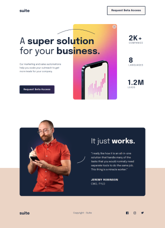
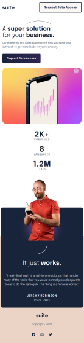

# Frontend Mentor - Suite landing page solution

This is a solution to the [Suite landing page challenge on Frontend Mentor](https://www.frontendmentor.io/challenges/suite-landing-page-tj_eaU-Ra). Frontend Mentor challenges help you improve your coding skills by building realistic projects.

## Table of contents

- [Frontend Mentor - Suite landing page solution](#frontend-mentor---suite-landing-page-solution)
  - [Table of contents](#table-of-contents)
  - [Overview](#overview)
    - [The challenge](#the-challenge)
    - [Live site](#live-site)
    - [Screenshot](#screenshot)
    - [Built with](#built-with)
    - [Here comes the Magic ✨](#here-comes-the-magic-)
  - [Author](#author)

**Note: Delete this note and update the table of contents based on what sections you keep.**

## Overview

### The challenge

Users should be able to:

- [x] View the optimal layout depending on their device's screen size
- [x] See hover states for interactive elements

### Live site

- [Live site](https://graceful-queijadas-947a95.netlify.app/)
- [Source code](https://github.com/astaba/suite-landing-page)

### Screenshot

  
<b>Open mobile screenshot</b>

  

### Built with

- Semantic HTML5 markup
- CSS custom properties
- Flexbox
- CSS Grid
- Mobile-first workflow

### Here comes the Magic ✨

To cope with overlapping elements apply `position: relative` without any **offset** and play with **negative margin.**

**Stark and Straight.**

## Author

- Website - [Astar Bahouidi](https://github.com/Matondo99)
